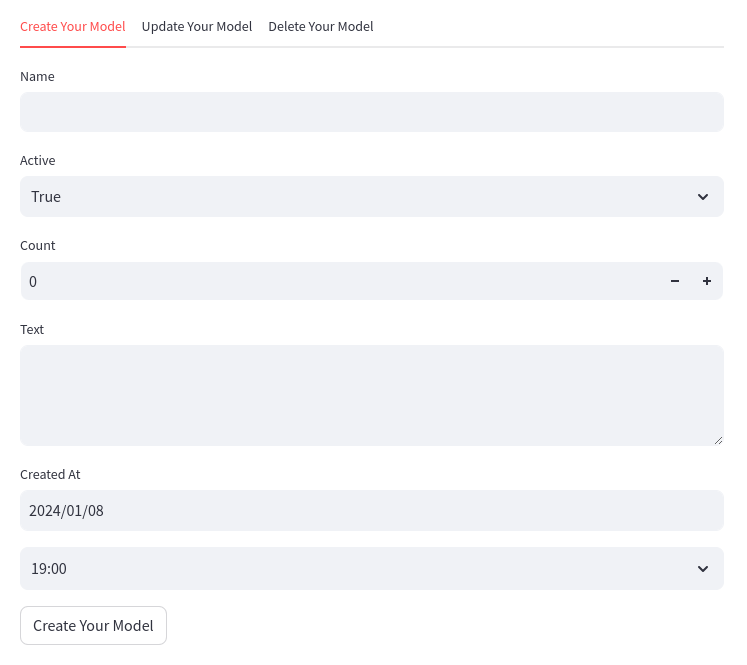
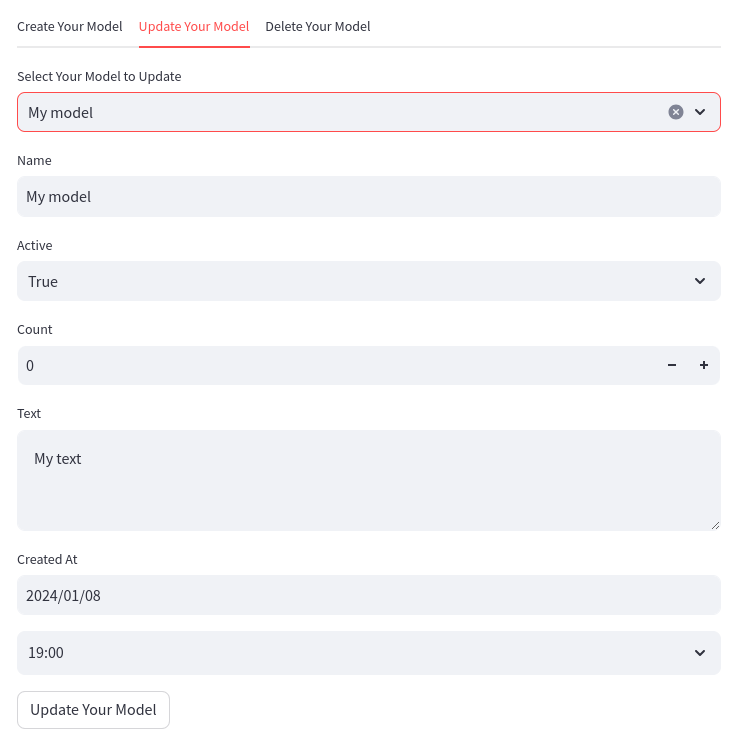

# Streamlit SQLAlchemy Integration

## Overview

`streamlit_sqlalchemy` is a Python module that provides seamless integration between Streamlit and SQLAlchemy models. It simplifies the process of creating, updating, and deleting database objects through Streamlit's user-friendly interface.




## Features

- **Easy Initialization**: Initialize the SQLAlchemy connection with a simple method call.
- **CRUD Operations**: Create, read, update, and delete operations are streamlined with minimal code.
- **Dynamic Forms**: Automatically generate forms for creating and updating database objects.
- **SQLTypes Support**: `String`, `Text`, `Integer`, `Float`, `Boolean`, `Date`, `DateTime`, `Time`.
- **Foreign Key Support**: Easily handle foreign key relationships in forms.

## Installation

```bash
pip install streamlit_sqlalchemy
```

## Usage

1. **Initialize the Engine:**

    ```python
    from streamlit_sqlalchemy import StreamlitAlchemyMixin

    # Create your SQLAlchemy model
    class YourModel(Base, StreamlitAlchemyMixin):
        __tablename__ = "your_model"

        id = Column(Integer, primary_key=True)
        name = Column(String)
        active = Column(Boolean, default=True)
        count = Column(Integer)
        text = Column(Text)
        created_at = Column(DateTime)

    # Initialize the connection
        StreamlitAlchemyMixin.st_initialize(connection=conn)
    ```

2. **CRUD Tabs:**

    ```python
    YourModel.st_crud_tabs()
    ```

3. **Create Form:**

    ```python
    YourModel.st_create_form()
    ```

4. **Edit Button:**

    ```python
    your_model_instance.st_edit_button("Edit", {"field": "value"})
    ```

5. **Delete Button:**

    ```python
    your_model_instance.st_delete_button()
    ```

## Advanced Usage

1. **Customize behavior with Meta Attributes:**

    ```python
    class YourModel(Base, StreamlitAlchemyMixin):
        __tablename__ = "your_model"

        id = Column(Integer, primary_key=True)
        name = Column(String)
        active = Column(Boolean, default=True)
        count = Column(Integer)
        text = Column(Text)
        created_at = Column(DateTime)

        # Customize the form fields with non-defaults
        __st_input_meta__ = {
            'name': st.text_input,
            'active': lambda *a, **kw: st.checkbox(*a, **kw, value=False),
        }

        # Customize display of the instances in the selectbox
        __st_repr__ = lambda _self: f'{self.name} ({self.count})'

        # Customize the order of the instances in the selectbox
        __st_order_by__ = lambda _self: self.count
    ```

2. **CRUD Tabs:**

    ```python
    YourModel.st_crud_tabs(
        defaults={"name": "Default Name"},  # Will not appear in the create form
        filter_by={"active": True},  # Will filter the instances in the selectbox
        except_columns=["active"],  # Will not appear in the update form
        border=True,  # Will add a border around the form
    )
    ```

3. **Create Form:**

    ```python
    YourModel.st_create_form(
        defaults={"active": False},  # Will not appear in the form
        border=True,  # Will add a border around the form
    )
    ```

4. **Edit Button:**

    ```python
    your_model_instance.st_edit_button(
        "Edit",  # Button label
        {"name": "New Name"},  # Will be updated on click
        # Any other kwargs will be passed to the st.button
    )
    ```

5. **Delete Button:**

    ```python
    your_model_instance.st_delete_button(
        label="Delete",  # Button label
        # Any other kwargs will be passed to the st.button
    )
    ```

## Simple Example

```python
import streamlit as st
from sqlalchemy import create_engine, Column, String, Integer
from sqlalchemy.ext.declarative import declarative_base
from streamlit_sqlalchemy import StreamlitAlchemyMixin

Base = declarative_base()

class ExampleModel(Base, StreamlitAlchemyMixin):
    __tablename__ = "example"

    id = Column(Integer, primary_key=True)
    name = Column(String)

# Initialize the connection
CONNECTION = st.connection("example_db", type="sql")
Base.metadata.create_all(CONNECTION.engine)
StreamlitAlchemyMixin.st_initialize(CONNECTION)

# Create CRUD tabs
ExampleModel.st_crud_tabs()
```

## Comprehensive Example

```python
import logging
from pathlib import Path

import streamlit as st

from examples.models import Base, Task, User
from streamlit_sqlalchemy import StreamlitAlchemyMixin


def show_single_task(task):
    col1, col2, col3 = st.columns([1, 1, 1])
    if task.done:
        col1.write(f" - ~~{task.description}~~")
        with col2:
            task.st_delete_button()
    else:
        if task.due_date:
            date_color = "red" if task.due_date < datetime.now() else "green"
            col1.write(f" - {task.description} (:{date_color}[{task.due_date.strftime('%H:%M - %d.%m.%Y')}])")
        else:
            col1.write(f" - {task.description}")
        with col2:
            task.st_edit_button("Done", {"done": True})
        with col3:
            task.st_delete_button()


def app():
    st.title("Streamlit SQLAlchemy Demo")

    User.st_crud_tabs()

    with CONNECTION.session as session:
        for user in session.query(User).all():
            with st.expander(f"### {user.name}'s tasks:"):
                c = st.container()

                st.write("**Add a new task:**")
                Task.st_create_form(defaults={"user_id": user.id, "done": False})
                with c:
                    if not user.tasks:
                        st.caption("No tasks yet.")

                    for task in user.tasks:
                        show_single_task(task)


def main():
    if not Path("example.db").exists():
        Base.metadata.create_all(CONNECTION.engine)

    StreamlitAlchemyMixin.st_initialize(connection=CONNECTION)

    app()


if __name__ == "__main__":
    # initialize the database connection
    # (see https://docs.streamlit.io/library/api-reference/connections/st.connection)
    CONNECTION = st.connection("example_db", type="sql")
    main()
```

You can explore this provided [example](./examples/example.py), and launch it from the root directory (because it relies on relative imports):

```bash
python -m streamlit run examples/example.py
```


## Contributing

We welcome contributions! See our [contribution guidelines](./CONTRIBUTING) for more details.

## License

This project is licensed under the Apache License 2.0 - see the [LICENSE](./LICENSE) file for details.
