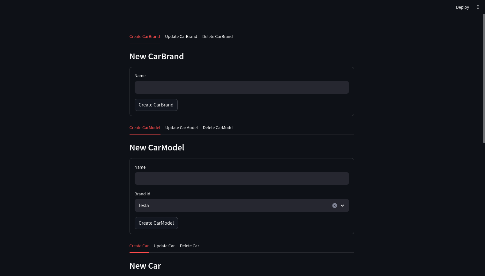

# streamlit-sqlalchemy

Some templating for streamlit and sqlalchemy



## Status & Objectives

 - [x] Integer fields
 - [x] String fields
 - [x] Many2One
 - [ ] Many2Many

## Usage

```bash
python3 -m pip install streamlit-sqlalchemy
python3 -m streamlit run example.py
```

Add the mixin to your SQLAlchemy defined class

```python
# sqlalchemy stuff
Base = declarative_base()
engine = create_engine("sqlite:///db.sqlite3")

class Awesome(Base, StreamlitAlchemyMixin):
    __tablename__ = "awesome"

    id = Column(Integer, primary_key=True)
    name = Column(String)
    other_field = Column(Integer)

```

Then you need to link the Mixin with the `Base`, in order to have access to the foreign keys. And to the `engine` for access to the database.

```python
# Must be called before any other method
StreamlitAlchemyMixin.sam_initialize(Base, engine)
```

Then you have access to streamlit components.

```python
# The classic 3 tabs
Awesome.sam_crud_tabs()

# Create
Awesome.sam_create_form()

# Update with a select choice on top
Awesome.sam_update_select_form()

# Delete with a select choice on top
Awesome.sam_delete_select_form()

for awesome in Awesome.sam_get_all():
    # Update a single element
    awesome.sam_update_form()

    # Delete an element
    awesome.sam_delete_button()
```

## Contribute

You are welcome to contribute!
